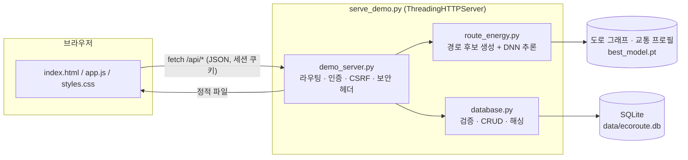

# EcoRoute (에코루트)

출발지·목적지·출발 시각·차종을 고르면 DNN이 후보 경로별 에너지 소비량과 CO₂ 배출량을 예측해 **가장 친환경적인 길**을 추천하는 웹 서비스입니다. 회원은 선택한 경로를 주행 기록으로 저장하고, 검색·정렬·수정·삭제하며, 이번 주 탄소 절감 리포트를 볼 수 있습니다.

Washtenaw County(미국 미시간) 도로망에서 여러 경로를 생성하고, 시간대별 교통 상태·도로 길이·경사도·차량 조건을 DNN에 입력해 비교합니다. 첫 화면은 **Ann Arbor** 지도로 열리며 **Washtenaw County** 확장 지도로 전환할 수 있습니다.

## 주요 기능

| 기능 | 설명 |
|---|---|
| 친환경 경로 추천 | 지도에서 출발·도착 노드 선택 → 후보 경로 4개의 예상 시간·거리·CO₂ 비교 |
| 회원 | 회원가입, 로그인·로그아웃, 닉네임·비밀번호 변경, 회원 탈퇴 |
| 주행 기록 CRUD | 경로 확정 시 자동 저장(Create), 목록·상세(Read), 이름·주행일·메모 수정(Update), 삭제(Delete) |
| 검색·정렬·페이지 | 이름·메모 검색, 주행일·절감률·거리·에너지 정렬, 10건 단위 페이지 이동 |
| 주간 리포트 | 이번 주 요일별 CO₂ 변화율, 선택 경로와 가장 빠른 경로의 CO₂·연료·비용·에너지 합계 |

로그인하지 않아도 경로 추천과 주간 리포트를 쓸 수 있습니다. 이때 기록은 브라우저 `sessionStorage`에만 남고, 로그인하면 계정(SQLite)에 저장됩니다.

## 기술 스택

| 영역 | 사용 기술 |
|---|---|
| 프런트엔드 | HTML, CSS, JavaScript (프레임워크 없음), Leaflet 지도 |
| 백엔드 | Python 표준 라이브러리 `http.server` (웹 프레임워크 없음) |
| 데이터베이스 | SQLite (`sqlite3` 표준 라이브러리) |
| 경로·모델 | OSMnx, NetworkX, PyTorch DNN, scikit-learn 베이스라인 |
| 배포 | Docker, GitHub Actions, Amazon ECR, EC2 (SSM) |

## 아키텍처



- 서버 하나가 정적 파일과 JSON API를 함께 제공합니다.
- 도로 그래프와 모델은 서버 시작 시 한 번만 메모리에 올리고, 최근 쓴 시간대의 교통 프로필을 캐시합니다.
- 요청마다 SQLite 연결을 새로 열어 스레드끼리 연결을 공유하지 않습니다.

**배포 흐름:** `main`에 push → GitHub Actions가 Docker 이미지 빌드 → 컨테이너 안에서 테스트 실행 → 스모크 테스트 → ECR 푸시 → SSM으로 EC2에 배포 ([cicd.yml](.github/workflows/cicd.yml))

## 실행

Python 3.14 환경에서 프로젝트 최상단의 실행 파일을 사용합니다.

```powershell
python -m pip install -r requirements.txt
python serve_demo.py
```

브라우저가 열리지 않으면 `http://127.0.0.1:8000`으로 접속합니다. 지도는 Leaflet CDN과 OpenStreetMap 타일을 쓰므로 인터넷 연결이 필요합니다. 첫 실행 시 `data/ecoroute.db`가 자동으로 만들어집니다.

Docker로 실행할 때는 DB 파일이 컨테이너 재생성 후에도 남도록 볼륨을 연결합니다.

```bash
docker build -t ecoroute .
docker run -p 8000:8000 -v ecoroute-data:/app/data/db -e ECOROUTE_DB_PATH=/app/data/db/ecoroute.db ecoroute
```

### 환경변수

| 이름 | 기본값 | 설명 |
|---|---|---|
| `ECOROUTE_DB_PATH` | `data/ecoroute.db` | SQLite 파일 경로 |
| `ECOROUTE_SECURE_COOKIE` | (꺼짐) | `1`이면 세션 쿠키에 `Secure` 추가. **HTTPS로 서비스할 때만** 켭니다. HTTP에서 켜면 브라우저가 쿠키를 저장하지 않아 로그인이 안 됩니다. |

## 테스트

```bash
python tests/test_database.py
python tests/test_api.py
```

| 파일 | 검사 내용 |
|---|---|
| `tests/test_database.py` | 회원가입 검증·중복, 비밀번호 해싱, 로그인 실패 메시지, 세션 해시 저장·만료, 비밀번호 변경 시 다른 세션 로그아웃, 탈퇴 시 연쇄 삭제, 주행 기록 CRUD·검증·검색·정렬·페이지, 타인 기록 403 |
| `tests/test_api.py` | 실제 HTTP 서버를 띄워 JSON 404/405, 인증 401, HttpOnly 쿠키, CSRF(Origin·Content-Type) 차단, 로그아웃 후 세션 무효화, 로그인 시도 제한 429, 보안 헤더, 500 응답에 내부 오류 비노출 |

지도와 모델을 불러오지 않으므로 몇 초 안에 끝납니다. CI에서는 빌드한 Docker 이미지 안에서 두 테스트를 실행합니다.

## API

전체 명세: [docs/API.md](docs/API.md)

| 메서드 | 경로 | 설명 | 로그인 |
|---|---|---|---|
| GET | `/api/regions` | 지역 목록 | |
| GET | `/api/regions/{key}` | 지역 지도 데이터 (노드, 차종) | |
| POST | `/api/route-calculations` | 친환경 경로 계산 | |
| POST | `/api/users` | 회원가입 | |
| GET · PATCH · DELETE | `/api/users/me` | 내 정보 조회 · 수정 · 탈퇴 | 필요 |
| POST | `/api/sessions` | 로그인 | |
| DELETE | `/api/sessions/current` | 로그아웃 | 필요 |
| GET · POST | `/api/trips` | 주행 기록 목록(검색·정렬·필터·페이지) · 저장 | 필요 |
| GET · PATCH · DELETE | `/api/trips/{id}` | 주행 기록 상세 · 수정 · 삭제 | 필요 |

## 데이터베이스

ERD와 설계 이유: [docs/ERD.md](docs/ERD.md)

```text
users 1 ──< sessions     (로그인 세션, 7일 만료)
users 1 ──< trips        (주행 기록)
```

탈퇴하면 `ON DELETE CASCADE`로 세션과 주행 기록이 함께 삭제됩니다. 길이·범위·양수 조건은 서버 검증과 별도로 테이블 `CHECK` 제약으로도 막습니다.

## 보안

| 위협 | 대응 | 위치 |
|---|---|---|
| SQL Injection | 모든 값은 `?` 플레이스홀더로 바인딩. 정렬 컬럼·방향은 허용 목록으로만 받음. 검색어의 `%`, `_`는 이스케이프 | `database.py` |
| XSS | 사용자 입력은 `textContent`로만 화면에 넣음. HTML 문자열에 넣는 값은 `escapeHtml` 처리. CSP로 외부 스크립트는 unpkg(Leaflet)만 허용 | `app.js`, `demo_server.py` |
| CSRF | 세션 쿠키 `SameSite=Lax` + 다른 출처 `Origin` 거부 + 본문 요청은 `application/json`만 허용 | `demo_server.py` |
| 비밀번호 유출 | PBKDF2-SHA256, 사용자별 salt, 60만 회 반복. 비교는 `hmac.compare_digest` | `database.py` |
| 세션 탈취 | 쿠키 `HttpOnly`(JS에서 읽기 불가), DB에는 토큰의 SHA-256 해시만 저장, 로그아웃 시 서버에서 삭제 | `database.py` |
| 무차별 대입 | 같은 IP·아이디로 5회 실패하면 10분간 429 | `demo_server.py` |
| 계정 존재 여부 노출 | 아이디·비밀번호 중 무엇이 틀렸든 같은 메시지, 없는 아이디도 같은 시간만큼 해시 계산 | `database.py` |
| 권한 없는 접근 | 주행 기록은 매번 소유자 확인, 타인 기록은 403 | `database.py` |
| 클릭재킹 | `X-Frame-Options: DENY`, CSP `frame-ancestors 'none'` | `demo_server.py` |
| 내부 정보 노출 | 예상 못 한 오류는 서버 로그에만 남기고 응답은 일반 메시지(500) | `demo_server.py` |
| 과도한 요청 본문 | 요청 본문 100KB 초과 시 400 | `demo_server.py` |

**알려진 한계**
- 로그인 시도 제한은 서버 메모리에 저장되어 재시작하면 초기화되고, 서버를 여러 대 띄우면 공유되지 않습니다.
- 주행 기록의 에너지·CO₂ 값은 클라이언트가 계산 결과를 보내 저장합니다. 본인 기록만 영향을 받지만, 조작을 막으려면 서버가 계산 결과를 보관하고 id만 받는 방식으로 바꿔야 합니다.

## 프로젝트 구조

```text
EcoRoute/
├─ .github/workflows/cicd.yml   # 빌드 · 테스트 · ECR · EC2 배포
├─ config/demo_runtime.json      # 지역·모델 경로 설정
├─ data/processed/               # 도로 그래프, 교통 프로필, 장소명
├─ docs/
│  ├─ API.md                     # API 명세
│  └─ ERD.md                     # DB 설계
├─ models/                       # DNN 가중치, 베이스라인 모델
├─ results/                      # 학습 지표와 그래프
├─ scripts/                      # 데이터 점검, 장소명 캐시 생성
├─ src/ecoroute/
│  ├─ demo_server.py             # HTTP 서버, 라우팅, 인증, 보안 헤더
│  ├─ database.py                # SQLite 스키마, 검증, 사용자·세션·주행 기록
│  ├─ route_energy.py            # 경로별 에너지 예측
│  ├─ routing.py                 # 경로 후보 생성
│  ├─ traffic_profiles.py        # 시간대별 교통 프로필
│  ├─ preprocessing.py           # 원본 데이터 전처리
│  ├─ map_preparation.py         # 도로 그래프 준비
│  ├─ training.py / dnn_training.py  # 베이스라인·DNN 학습
│  └─ __init__.py
├─ tests/
│  ├─ test_database.py
│  └─ test_api.py
├─ web/
│  ├─ index.html
│  ├─ app.js
│  ├─ styles.css
│  └─ logo.png
├─ serve_demo.py                 # 웹 서버 실행
├─ preprocess.py, prepare_map.py, build_traffic.py, train.py, train_dnn.py, route.py, predict_routes.py
├─ Dockerfile
└─ requirements.txt
```

백엔드 실행에 필수인 산출물은 다음과 같습니다.

- `models/dnn/best_model.pt`: 학습된 에너지 소비 예측 DNN 가중치
- `data/processed/maps/*/..._drive_enriched.graphml`: 도로·길이·제한속도·고도가 포함된 지역별 그래프
- `data/processed/traffic/*/edge_hourly_profiles.csv.gz`: 도로별 24시간 교통 프로필 압축본

Ann Arbor 노드의 장소명 캐시는 아래 명령으로 다시 만들 수 있으며, 이 단계에서만 OpenStreetMap 데이터를 내려받습니다.

```powershell
python scripts/build_ann_arbor_place_labels.py
```

## 과제 주차별 진행

| 주차 | 내용 | 결과물 |
|---|---|---|
| 1 | Git, HTML/CSS/JS 기초 | `web/` 화면 |
| 2 | 클라이언트 ↔ 서버 통신 | `http.server` 기반 JSON API |
| 3 | DB 연동 | SQLite 스키마(`users`, `sessions`, `trips`), ERD |
| 4 | CRUD | `/api/trips` 생성·조회·수정·삭제 |
| 5 | 사용자 기능 | 회원가입·로그인·로그아웃·계정 관리, 사용자별 데이터 분리 |
| 6 | 기능 확장 | 검색·정렬·페이지 이동, 내 기록 화면, 주간 리포트 DB 연동 |
| 7 | 테스트·보안 | 입력 검증, SQL Injection·XSS·CSRF 대응, 로그인 시도 제한, 보안 헤더, 자동 테스트 |
| 8 | 최종 정리 | README, API 명세, ERD, CI 테스트 |

## GitHub에 올리지 않는 항목

`.gitignore`는 아래 로컬 자산을 제외합니다.

- `data/raw/`, `data/cache/`: eVED/VED 원본 데이터와 재생성 가능한 중간 캐시
- 학습용 세그먼트·trip profile·감사 결과(전처리 설명과 요약 JSON은 유지)
- 압축 전 대용량 교통 CSV, 행별 예측 CSV, 실행 시 재생성되는 경로 결과
- 로컬 SQLite 파일(`*.db`), Python 캐시, 개인 VS Code 설정과 가상환경

GitHub 웹의 **Add file**은 `.gitignore`를 적용하지 않으므로, 수동 업로드할 때는 위 구조에 있는 파일만 선택합니다. 특히 `edge_hourly_profiles.csv`가 아니라 `edge_hourly_profiles.csv.gz`를 올립니다.

## 모델 출력 범위

탄소 환산은 휘발유 에너지 33.7 kWh/US gal과 직접 배기관 배출 8.887 kg CO₂/US gal을 사용합니다. 표시값은 모델과 환산 가정에 기반한 참고용 추정치이며 실제 배출량이나 절감 효과를 보장하지 않습니다. 연료 생산·정제·운송과 차량 제조 배출량은 포함하지 않습니다.

## 데이터 출처

- [Vehicle Energy Dataset (VED)](https://github.com/gsoh/VED)
- [Extended Vehicle Energy Dataset (eVED)](https://bitbucket.org/datarepo/eved-dataset/src/main/)
- [OpenStreetMap](https://www.openstreetmap.org/copyright) 도로 데이터
