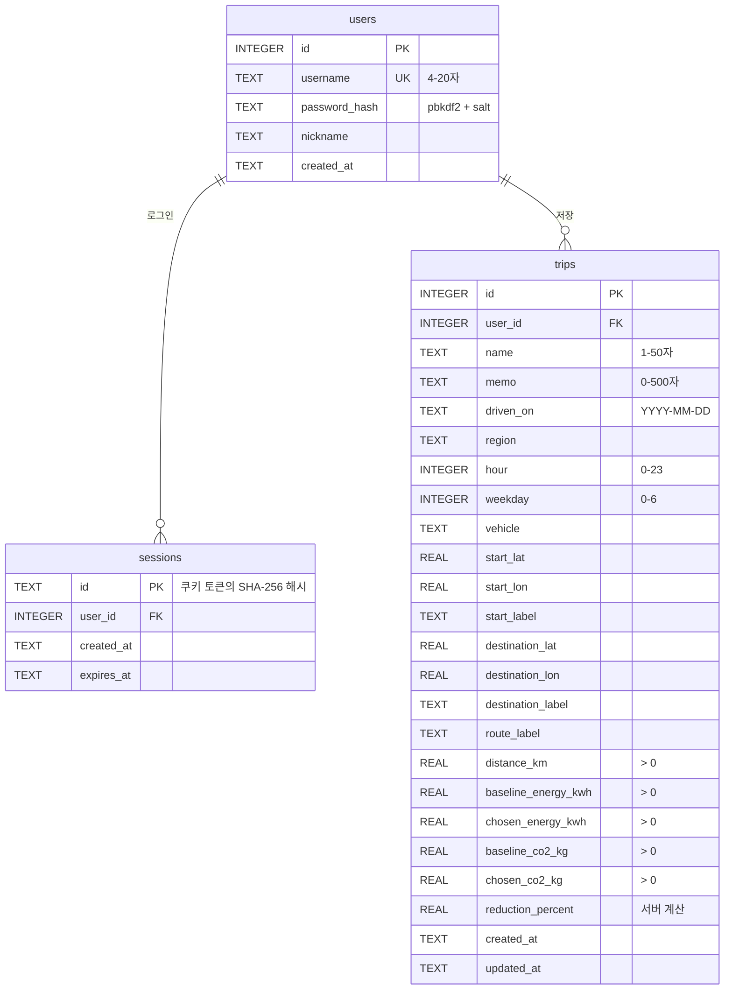

# EcoRoute ERD

DB: SQLite (`data/ecoroute.db`, 환경변수 `ECOROUTE_DB_PATH`로 변경 가능)
스키마 정의: [`src/ecoroute/database.py`](../src/ecoroute/database.py)의 `SCHEMA`

## 설계 메모

| 결정 | 이유 |
|---|---|
| `ON DELETE CASCADE` (sessions, trips → users) | 회원 탈퇴 시 세션·주행 기록 자동 삭제 |
| `CHECK` 제약 (길이, 범위, 양수) | 서버 검증을 빠져나간 값도 DB에서 한 번 더 차단 |
| `reduction_percent`를 컬럼으로 저장 | 정렬(`sort=reduction_percent`)에 필요, 저장 시 서버가 계산 |
| 좌표를 `start_lat` 등 평탄한 컬럼으로 저장 | SQLite에 객체 타입이 없음. API 응답에서만 `start: {lat, lon, label}`로 묶음 |
| 인덱스 `(user_id, driven_on)` | 목록 조회는 항상 "내 기록 + 날짜순"이 기본 |
| 시간은 UTC ISO 8601 문자열 | SQLite에 날짜 타입이 없음. 같은 형식이면 문자열 비교가 곧 시간 비교 |
| `regions`, `vehicles` 테이블 없음 | 설정 파일(`config/demo_runtime.json`)과 코드에 고정된 값이라 서버에서 검증만 함 |
| 세션 id에 토큰 대신 해시 저장 | DB 파일이 유출돼도 살아 있는 세션을 바로 쓸 수 없음 |
| 비밀번호 `pbkdf2_sha256$반복횟수$salt$hash` 형식 | 반복 횟수를 함께 저장해서 나중에 횟수를 올려도 기존 해시 검증 가능 |
